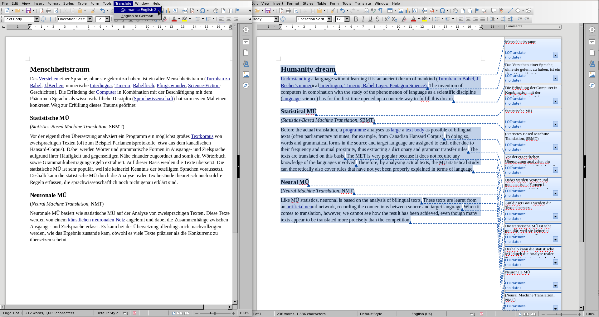

# LibreOffice Translate

This is an extension providing Neural Machine Translation for
LibreOffice with a single click.

## Installing

Install the OXT from the [Release pages](https://github.com/lernapparat/lotranslate/releases/).

## Installing Models

Download and unpack the model.
In Options -> Language -> Translation choose New and select the `.json` file.

You should get an entry in the new Translation menu for the model.

Select (formatted) text to translate and hit translate.

## Building and other technical notes

See the [Technical notes](webpage/technical_notes.md) for build instructions.

## License

This extension is licensed under the Mozilla Public License v2 and the GNU
Lesser GPL v3+. You may choose either license. Restrictions to
third-party code and models may apply.

## Acknowledgement

This project has received funding from the German [Federal Ministry of
Education and Research](https://bmbf.de/) through the
[Prototype fund](https://prototypefund.de/).

 